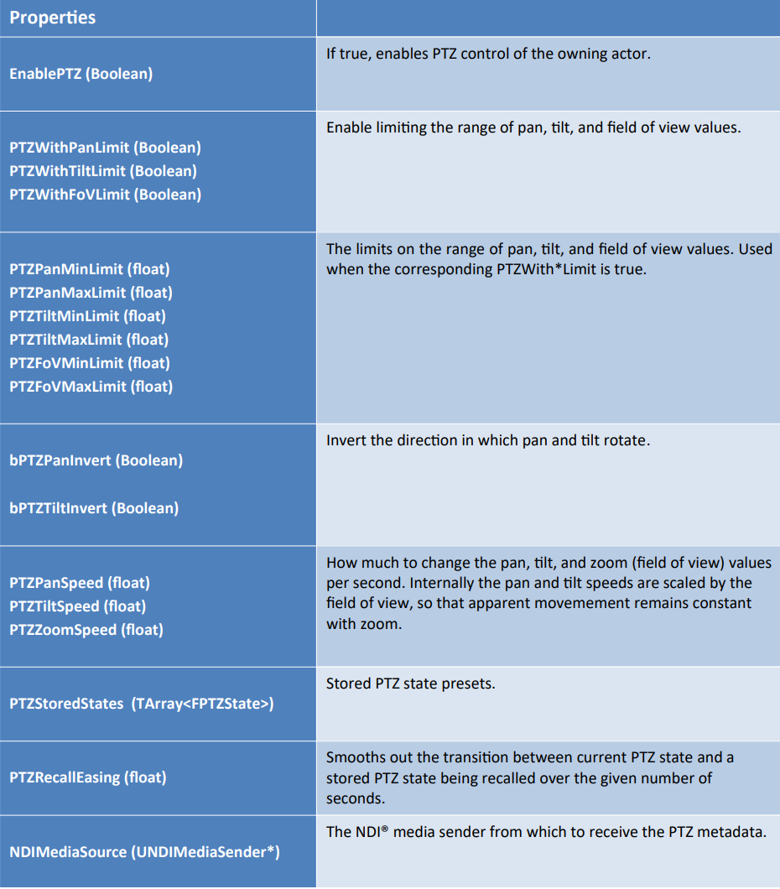

# Advanced

### NDI Broadcast Configuration

Essential properties used for modifying the broadcast configuration for an NDI Media Sender.

<figure><figcaption></figcaption></figure>

The NDI Broadcast Configuration structure is used when initializing or changing the broadcast configuration of an NDI Media Sender object.

### NDI Connection Information

Defines a collection of properties which describe the Source Information for NDI® connections. This structure is returned _**by Find Network Source by Name.**_ Obtaining the NDI Source Information is the first step before connecting to an NDI source on the network.

<figure><figcaption></figcaption></figure>

<figure><figcaption></figcaption></figure>

To get NDI Source Information, call the “Blueprint Library Function” called _**Find Network Source By Name.**_ To get a collection of multiple NDI Source Information structures, call **Get NDI Source Collection.** \
\
The collection can be iterated and used to “Start Broadcasting” or “Change Connection Information” on an Input Source object.

### NDI Receiver Performance Data

List of commands that provide detailed information on an NDI source and sender.

<figure><figcaption></figcaption></figure>

To get an NDI Receiver Performance Data structure, call the GetPerformanceData function on an NDI Receiver Component object in blueprints. This data can be useful for determining how strong/reliable the connection to the NDI® sender is.

### NDI Broadcast Component

Provides a wrapper around the NDI Media Sender to access functionality from Blueprints and perform simple broadcasting functionality.

| Properties                        |                                                                                                                               |
| --------------------------------- | ----------------------------------------------------------------------------------------------------------------------------- |
| NDIMediaSource(UNDIMediaSender\*) | A pointer to the Media Sender object representing the configuration of the network source to send audio, video, and metadata. |

<figure><figcaption></figcaption></figure>

Adding the _**NDI Broadcast Component**_ to an Actor in blueprints give your actor functionality for broadcasting audio, video, and metadata frames over NDI®.

### NDI Finder Component

Provides a component used for essential functionality when dealing with finding NDI® sources on the network allowing you to get a collection of sources as well as listen for events when the source collection has changed.

| Functions                                                     |                                                                      |
| ------------------------------------------------------------- | -------------------------------------------------------------------- |
| FindNetworkSourcebyName (FNDIConnectionInformation&, FString) | Attempts to find a network source by the supplied name.              |
| GetNetworkSources() (TArray)                                  | Returns the current collection of NDI® sources found on the network. |

<figure><figcaption></figcaption></figure>

Adding the NDI Finder Component to an Actor in blueprints give your actor functionality for finding NDI® sources on the network. This retrieves a collection of network sources as well as notifies of changes to the NDI® source collection.

### NDI Receiver Component

Provides a wrapper around the NDI Media Receiver to access functionality from Blueprints and perform simple receiver functionality.

<figure><figcaption></figcaption></figure>

<figure><figcaption></figcaption></figure>

Adding the NDI Receiver Component to an Actor in blueprints give your actor functionality for receiving audio, video, and metadata frames from a connected NDI® sender.

### NDI Viewport Capture Component

Provides a component to be used to capture additional viewports for broadcasting over NDI®

<figure><figcaption></figcaption></figure>

<figure><figcaption></figcaption></figure>

Adding the NDI Viewport Capture Component to an Actor in blueprints give your actor functionality for rendering the viewport, while providing audio, video, and metadata frames from a connected NDI® sender.

### NDI PTZ Controller Component

Provides a component for PTZ control from an NDI® sender. Typically this is part of an NDI® Broadcast Actor. It can also be applied to any other type of Actor, with some limited functionality.

<figure><figcaption></figcaption></figure>

<figure><figcaption></figcaption></figure>

### NDI Media Receiver

Content used to provide functionality for receiving audio, video, and metadata frames over NDI® to a connected NDI® sender.

<figure><figcaption></figcaption></figure>

<figure><figcaption></figcaption></figure>

<figure><figcaption></figcaption></figure>

<figure><figcaption></figcaption></figure>

Creating an NDI Media Receiver will provide configuration details to an NDI Receiver Component. Using the context menu of the content browser, you can create an NDI Media Receiver using the menu “Media” and locating the “NDI Media Receiver” entry. This will allow you to create a virtually unlimited number of NDI® receiver objects.

### NDI Media Sender

<figure><figcaption></figcaption></figure>

<figure><figcaption></figcaption></figure>

<figure><figcaption></figcaption></figure>

Creating an NDI Media Sender will provide configuration details to an NDI Broadcast Component or NDI Viewport Capture Component. \
\
Using the context menu of the content browser, you can create an NDI Media Sender using the Media menu and locating the “NDI Media Sender” entry. This allows you to create a virtually unlimited number of NDI® sender objects.

### NDI Media Sound Wave

An NDI® IO Plugin specific SoundWave object used to provide functionality for playback of NDI® audio frames from an NDI® sender.

<figure><figcaption></figcaption></figure>

Creating an NDI Media Sound Wave will provide configuration details to an “NDI Reciever Component”. \
\
Using the context menu of the content browser, you can create an NDI Media Sound Wave using the menu Sounds

### NDI Media Texture 2D

An NDI® IO Plugin specific Texture2D object used to provide functionality for playback of NDI® video frames from an NDI® sender. Creating an “NDI Media Texture2D” will provide a texture object used by an NDI Media Receiver. Using the context menu of the content browser, you can create a NDI Media Texture 2D using the menu Materials and Textures, and locating the “NDI Media Texture 2D” option.

### NDI Broadcast Actor

An Actor which can be added to the scene that renders a new video texture from the viewpoint of the actor’s transform. Provides support for broadcasting the texture as a video frame to connected to an NDI® receiver.

<figure><figcaption></figcaption></figure>

Adding an “NDI Broadcast Actor” to a scene will provide an easy way to render a viewport to be sent over NDI® to connected NDI® receivers. You can find the “NDI Broadcast Actor” in the sub menu of “NDI®” within the Modes panel in the editor for your project.

### NDI Receive Actor

An Actor you can add to the scene to display NDI® sender audio, video, and metadata frames in the virtual scene

<figure><figcaption></figcaption></figure>

<figure><figcaption></figcaption></figure>

Adding an “NDI Receive Actor” to a scene will provide an easy way to show video in a virtual environment. You can find the NDI Receive Actor in the “NDI®” sub menu within the “Modes” panel in the editor for your project.
